# Technical Description - Traps & Punishment

**Author:** Zirui Zhou

[Project case study](the-witchs-puppet-project-case-study.md)

## Project Context and My Role

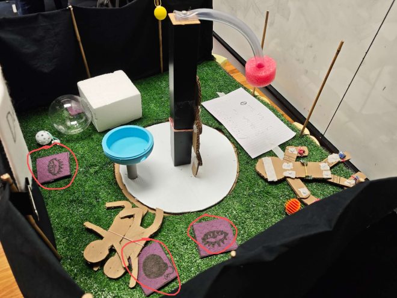

Our group’s project, initially called ‘Dungeon Escape’ and later named ‘The Witch’s Puppet’, where the witch tied in the middle have to control the puppet who is completely blind and deaf to pick up keys and put them into the groove in corresponding order. While the puppet move around, there will be traps that punish the witch if the puppet step onto it.

As the picture illustrated, I am responsible for traps and the punishment structure.

## Design Requirements and Initial Approach

As we expected from the beginning, the trap should be imperceptible, which means the puppet shouldn’t be aware when he/she stepped unto it, so the the witch will be continuously punished until the puppet move away.

SO my idea at first was to make a distance sensitive trap that detects the deformation of the stepping layer when the puppet step onto it. It will have a cover layer for the puppet to step on as well as for the sensor to detect the deformation. Then the problem comes to, how would I be able to hide all those sensors and circuit components below a structure that the puppet will not be noticed? It must be low and smooth enough compare to the normal ground to not let the puppet be noticed.

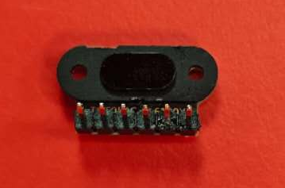

This was the first difficulty I had encountered when I’m using the TOF050C, which is called the Time of Flight Laser Ranging Sensor Module.

This sensor sends out a single laser and detects the bouncing time to calculate the range of the object in front of it.

In order to let the player move smother and less annoyed by wires and cables, I decide to use ESP 32 as the board to send out signals remotely, so that a 5v battery is enough to power up a group of trap.

To establish a stable and reusable circuit, I used solder to attach extra footer onto the sensor as well as connecting cables. I also plan to add a LED strip into the system as an indicator for audiences and the witch to know which trap is triggered.

## Success Criteria

As long as the trap detection functions as expected, the puppet will not be awared whether the trap is triggered or not, and the witch and audiences will know which trap is triggered, then it is succeed.

## Initial Structure

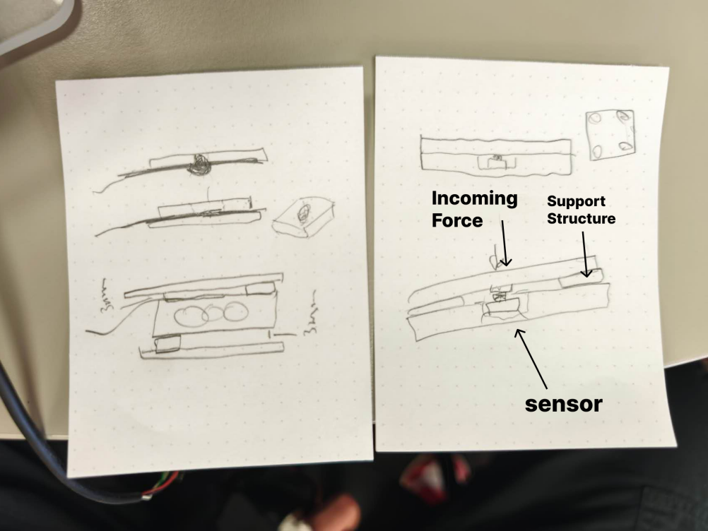

The accompanying illustration shows the basic idea of how this trap is working, there will be support structure between the top and the bottom layer to allow the top layer to have deformation space. Then the sensor will collect the data. The accompanying circuit image illustrates the electronics; the initial 3D-printed structure is discussed separately.

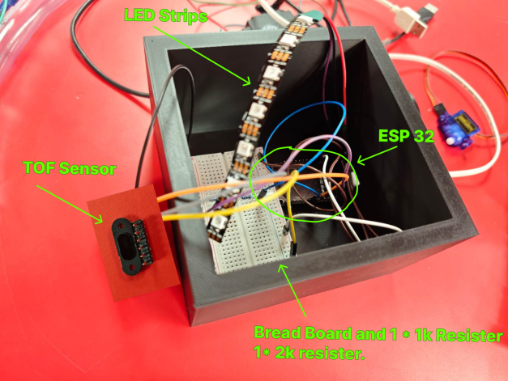

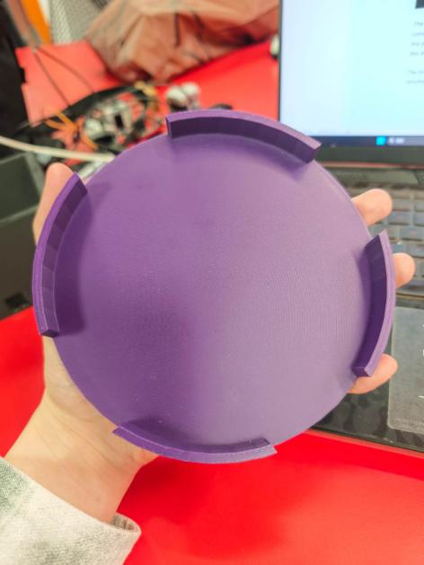

The circuit react smoothly, so I plan to build a 3D structure to contain the circuit structure. After communication with team mates, we believe the trap shouldn’t be too thick or too high, so that the puppet who can’t see will not be tripped over by the trap. It also have to be big enough to let the deformation happens obvious enough for the sensor to detect.

The initial 3D structure looks like the accompanying prototype, it’s a circle plate with four supporting structures and space to contain circuits. However, it did not fulfill it’s design purpose. It’s a bit too high for puppet to ignore the shape when step onto it, and too low at the same time to not damage the component after covering the circuit on the ground. I.e. if hide all components directly under this plate, the wire would be bent too much to transfer signals.

So this plan was abandoned, as well as the intention to let the puppet step onto the trap. Unless we can raise the ground of the 3\*3m field and place those traps at the same height, otherwise this stepping trick is difficult to be imperceptible.

## Iterations and Fabrication

Fortunately, there’s another sensor called ultrasonic distance sensor that detects wider area of distance compared to the TOF sensor, which means I can place it aside and detects whether the player’s feet is within the certain range.

The puppet no longer need to step onto the trap, it will be triggered as long as the player is closer enough to the trap. The new circuit structure was created, come alone with the 3D printed container. Version 1 looks like below:

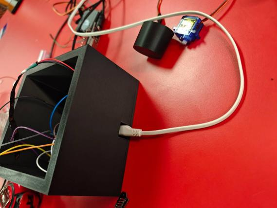

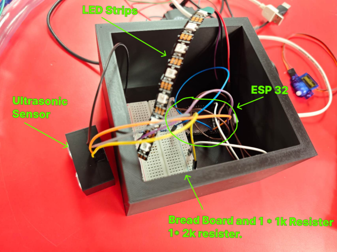

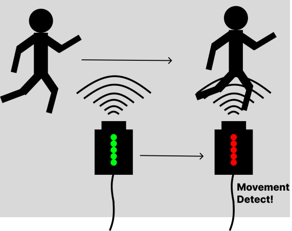

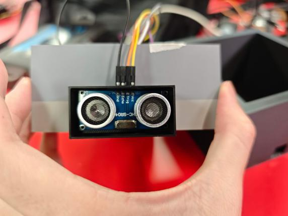

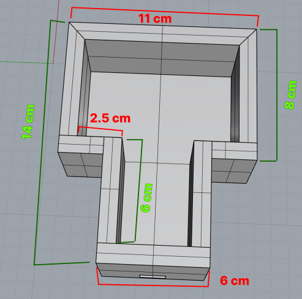

As the photo illustrated above, I have designed a container to put the circuit in, so that it will not be damaged easily if the player accidentally kicked or stepped onto it. However, the box for version 1 seems too large to safely contain all the components without worrying the displacement when experiencing shaking and rolling. So after measuring the specific length of each component, version 2 was designed as shown in the accompanying illustration. The wider area is for the bread board, and the thinner and longer area is for ESP 32 Board. Version 2 successfully limited the movement of each component and maintained the position of every cables.

## Microcontroller Selection and Wireless Communication

The purpose of the trap is to activate the ‘punishment machine’ hangs at the top of the witch, since these traps will be randomly located for each new round, cables and wires is the biggest limitation that might affect puppet’s movement. So our group decides to use remote communication, which comes to the ESP 32, the micro-controller integrated with Wi-Fi and Bluetooth communication.

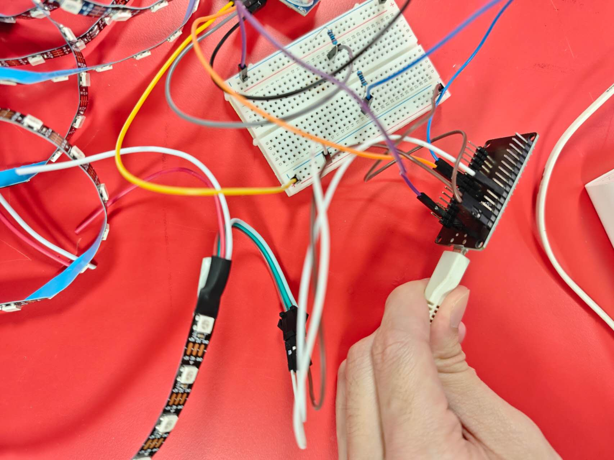

This micro-controller allows remote data transmission with 5v and 3.3v power outlet, and up to 30 pins (includes power) for components. However, the operating current is lower than Arduino UNO (about 500mA), so extra power supply is needed to drive components like motor.

Since the data is sent by the trap and received by the punishment system, 2 esp32 is needed to communicate between each other.

As the research and AI suggested, a communication method called ‘ESP NOW’ is highly recommended by sending the data through ESP32’s Wi-Fi module directly to another ESP32 with corresponding MAC address without using actual WLAN.

So the whole system was developed based on 2 separate codes, correspondingly responsible for sending and receiving. More specifically, the sending code receives data from ultrasonic distance sensor, and sends out through ESP-NOW, while triggers color changing of LED strip. On the other side, another ESP 32 receives the data and trigger the servo if the trap was triggered.

The following images show excerpts of the sending and receiving code.

## Limitations and Next Iteration

Since this ‘pass through detecting’ trap is a bit large in volume, a kicking or treading could seriously damage and affect the current circuit, even under the protection of 3D printed shell. And a bread board is used with unsturdy cable connection for this ‘Tech Spike’. The next iteration will focus on reducing its volume and reinforce the stability of the circuit.

## Prototype Outcome

The answer is yes for the current period. The trap can be triggered accurately and rapidly, the delay of data transmission between two ESP32 is within acceptable range, so I believe my design has achieved its design purpose.
