# The Witch’s Puppet — Project Case Study

**Author:** Zirui Zhou  
**Institution:** University of Queensland

[Technical Description - Traps & Punishment](technical-description-traps-and-punishment.md) · [Project demonstration](https://www.youtube.com/watch?v=2GjQerEt0JA)

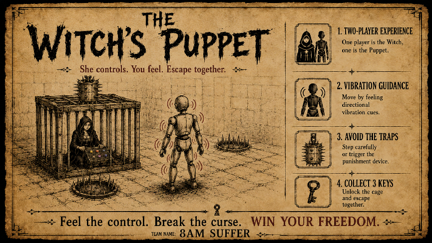

*Figure 1: Poster for The Witch’s Puppet.*

## Project Overview

Traditional carnival games usually provide players with visual appeal, extreme emotional feedback, and a sense of achievement by using lights, sounds, and interactions. They test players’ strength, speed, accuracy, and reactions by setting up simple rules and different levels of challenges, bringing happiness and an unforgettable experience to both players and spectators. What will carnival games look like in the future?

This paper presents an interactive prototype project that explores a alternative theme to traditional competitive carnival games: cooperation. In this game, two players act separately as the witch and the puppet. The goal is simple: the witch has to control the movement of the puppet (who is blind and deaf) through a panel, and the puppet has to follow the commands to move around the field, collecting keys while avoiding traps.

This project shows our understanding of and attempts toward future carnival games. It will also show how this game creates cooperative experiences through restricted, asymmetrical communication, and physical interaction.

## Research Areas

- **Human-centered computing** → Interaction Design → Interaction design process and method

- **Hardware** → Sensor devices and platforms

## Keywords

Interaction Design, Carnival Games, Physical Interactive Experience, Haptic Communication, Remote Data Transmission through Electrical Components

## Introduction

From remote communication to virtual reality, the forms of interaction that humans can experience have been constantly changing with the development of technology. The same goes for carnival games. From the baseball toss, balls-in-the-bucket, and ring toss seen in old carnival photos [2], to Whac-A-Mole, Dance Dance Revolution, Laser Maze, and VR shooting games, the evolution of technology has enriched the ways users can interact with games. It can be expected that technology will play a larger role in future carnival games, creating more immersive and realistic experiences for players and offering developers more design opportunities and creative expressions.

Inspired by marionettes and dungeon escape rooms, Witch’s Puppet combines both puppet manipulation and escape elements to provide a unique experience for players. Similar to a marionette show, the witch needs to control the movement of the puppet, while the puppet has to avoid traps and collect keys hanging in random locations, ultimately saving the witch from the cage.

This project aims to explore the relationship between technology and interaction, as well as define a possible theme for future carnival games. Specifically, technology uniquely shapes the gameplay experience by challenging players to maintain remote communication within a restricted environment.

## Related Work and Inspirations

The inspiration for this project came from various aspects. The way of communication between the witch and the puppet imitates the manipulation of the traditional ‘Marionette’, where strings are attached all around the puppet’s body to enable sensitive movement control [4].

*Figure 2: A puppeteer is showing his puppets*

Instead of using strings and ropes, this project integrates electronic components and wearable haptics to maintain communication between the witch and the puppet, solving both distance and stability problems for remote control. The concepts of the cage, traps, and the rescue mechanism came from the game ‘Dungeon Escape’, where the player needs to get keys while avoiding traps and monsters, ultimately escaping from the dungeon [1]. 

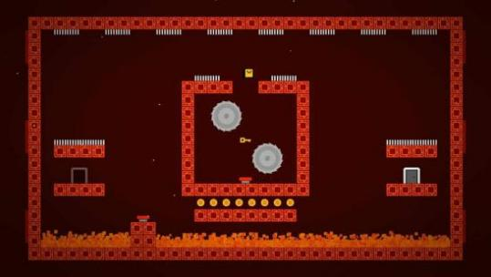

*Figure 3: The game ‘Dungeon Escape’*

However, instead of punishing the puppet who triggers the trap, the punishment system—which is remotely connected to the traps—will punish the witch who controls the puppet. This means the witch has to bear the consequences for leading the puppet into a trap.

In addition, this game grounds the witch and deprives the puppet of sight and hearing, so that the witch can only give commands, and the puppet can only follow them without knowing the exact situation. This idea was extracted and combined from the games ‘It Takes Two’ and ‘Keep Talking and Nobody Explodes’.

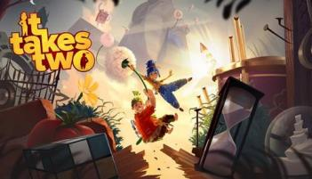

*Figure 4: It Takes Two.*

 

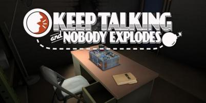

*Figure 5: Keep Talking and Nobody Explodes.*

While both games emphasize cooperation between players, ‘It Takes Two’ focuses more on collaboration to solve puzzles and difficulties together [5], whereas ‘Keep Talking...’ highlights the information asymmetry between players [3]. Therefore, Witch’s Puppet extracts the idea of ‘cooperation’ while maintaining ‘information asymmetry’ to form a completely different experience between the witch and the puppet.

## Design and Implementation

Considering the player experience and difficulty level, this game removes the time limit to ensure that every pair of players can finish the game. Players are allowed to have a conversation before the start of the game to discuss any strategy. With three keys in total, the puppet can only carry one key at a time until it is placed into the correct slot. While this game focuses mainly on communication and punishment, the gameplay flow is relatively simple.

1. Discuss strategy.
2. Test the vibration mappings.
3. Navigate the space and avoid traps.
4. Collect and place the keys.
5. Unlock the cage.

### Technical Detail

The core component of this project is the esp-32 Module, it ensures the remote communication while prevent the puppet from tripping over the circuits when moving around. 11 ESP-32 S3 Zero and 1 ESP-32 Devkit v1 were used for the final iteration, 4 on the traps, 1 on the punishment system, 1 for the controller, and 6 for the wearable set.

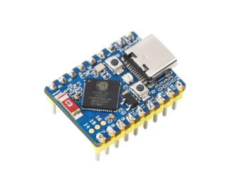

*Figure 6: ESP32 S3 Zero.*

 

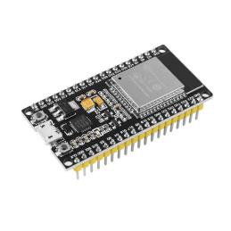

*Figure 7: ESP32 Devkit V1.*

Six 5V mini vibration motors are deployed on the wearable set, with each connected to an ESP-32 S3 Zero.

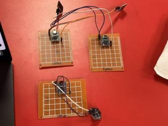

*Figure 8: Vibration motor and ESP32 assembly.*

 

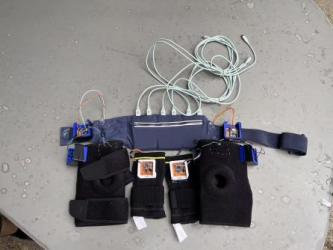

*Figure 9: Complete wearable haptic system.*

The controller is composed of 6 buttons and 1 ESP-32, each button sends signals through a specific MAC address corresponding to the unique esp-32 attached to puppet’s body.

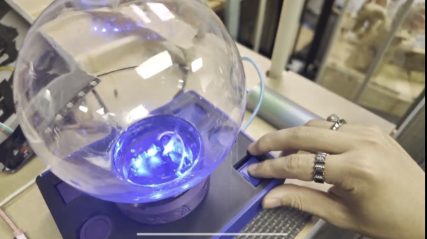

*Figure 10: Controller Display*

For the traps, each is composed of 1 esp32 and 1 ultrasonic sensor. The ultrasonic sensor emits ultrasonic waves forward and returns the distance of the closest object within a fan-shaped area.

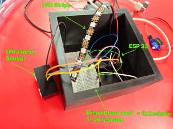

*Figure 11: Trap structure.*

 

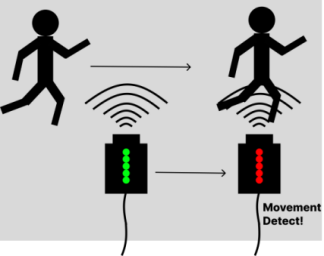

*Figure 12: Ultrasonic sensing illustration.*

A 360-degree 20kg motor is used to drive the punishment system to move back and forth repeatedly whenever any trap is triggered. An ESP32 is connected to the motor to receive signals from the traps.

3 Hall sensors are attached under each of the key slots to detect magnets under each key.

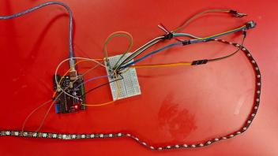

*Figure 13: Arduino Uno and three Hall sensors.*

 

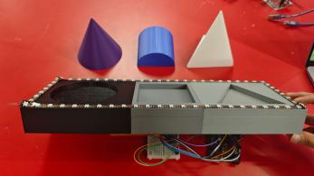

*Figure 14: Keys and matching key slots.*

If all keys are placed in the correct slots, a 12kg servo motor will raise the lock bolt and release the witch.

The ESP32 modules communicate through the ‘ESP-NOW’ protocol. It is the most appropriate method according to the demands of low latency, multiple ESP32 module transitions, and separate power supplies.

### Technical Walk-through

Integrating the technical detail into the walk-through:

1. The witch press buttons on the controller, sending signals through different MAC address to related ESP-32 attached around puppet’s body.
2. Puppet move his limb according to the vibration triggered by the vibration motor.
3. The ultrasonic sensor scans the space at its front, returning signals when the object is within the certain range. Once the indicating LED light turns into green, the trap is then triggered, data sent through ESP-32.
4. The ESP-32 for the punishment system receives the command of ‘triggered’, then the motor start to rotate back and forth 1 round per 2 seconds.
5. The puppet grabs the hanging key under the guidance.
6. The puppet put the key into the correct slot, the magnet under the key triggers the hall sensor, indicator LED turns on.
7. After all the keys are placed in the correct slot, the LED light around the key slot will flick, and the 12kg motor will be triggered to unlock the cage.

## Experiential Contributions

This project explores three concepts from different aspects in terms of information acquisition and utilization, communication under a restricted environment, and the theme for future carnival games.

### Asymmetric Information Experience

The ‘Witch’s Puppet’ emphasizes imbalanced information collection and operation. The witch can only see the situation on the game field, including the locations of traps and keys, but she cannot move around by herself to directly utilize the information she has acquired. The puppet can move around and make direct contact with the environment; however, it cannot acquire direct visual or auditory information, and its movement depends fully on the vibrations sent by the witch. This unequal information acquisition and application is one of the main experiential contributions of this project.

### Communication Under Restricted Environment

Another contribution of this project follows the information collection stage. How can we maintain the information transmission between two ‘sensory-deprived’ players when the primary methods of communication used by humans are prohibited? The solution from Witch’s Puppet introduces ‘haptic communication’ by implementing a remote vibration system to maintain communication under a restricted environment. This solution is proposed based on the information loss occurring during the transmission from the witch’s visual signals to the puppet’s haptic sensations. This experience holds significant promise for exploring haptic information exchange when conventional communication is restricted in emergencies or special environments.

### Re-imagine the Carnival Experience

Traditional carnival games primarily challenge players through competition, such as comparing scores or completion times [6]. In contrast, this work explores a novel concept: encouraging cooperation under system-imposed restrictions, emphasizing the shift in the relationship between players from competitors to collaborators while preserving the fun of carnival games.

## Exhibition Evaluation

This game was tested by different user groups during the exhibition, from middle school students to the elderly, where various performances were collected and analyzed in three aspects: communication, cooperation, and completion.

### Communication

According to the recordings, most of the teams established relatively clear communication at the initial stage of the game. Witches tended to map the button layout to the puppet, then performed actions according to the puppet's motion patterns. Puppets showed various moving patterns in response to the vibration. A single group of players failed to build a clear communication protocol, which took them a considerable amount of time to complete the game. This was due to the thick clothing the puppet wore, which blocked the vibration sensation. The overall feedback proves the possibility of establishing simple communication through vibration alone.

### Cooperation

Observations showed that after establishing a basic communication protocol, the puppet and witch roles began collaborating, typically by adapting to each other's behavioral patterns. All groups attempted collaboration once they understood the rules; no participants insisted on playing independently. Post-game feedback revealed no negative comments regarding the game's enjoyment. These results demonstrate that a cooperative theme, rather than competition, can successfully deliver an engaging and memorable experience for both players and spectators in a carnival game context.

### Completion

Most of the groups finished the game within 10 minutes, indicating a relatively successful design in terms of game difficulty and process duration. Our analysis indicates that groups with longer completion times typically faced one or more of the following issues: unclear communication protocols, attenuated vibration sensation due to thick clothing, misunderstanding of game objectives, or misinterpretation of the vibration signals.

## Reflections

Through the development and user testing of this interactive game, three main insights were gained. First, when communication is restricted, players attempt to develop new protocols from limited information through iterative practice. This is shown in their attempts to figure out specific button mappings and construct a shared protocol. Second, while exploring new communication modalities, players build trust through interaction. This manifests in the 'puppet' role (who lacks visual and auditory cues) consistently following the 'witch's' signals, demonstrating unconditional trust. Finally, a complex circuit and technical structure is not a prerequisite for an excellent game. When the core concept is sufficiently novel and engaging, technology serves primarily as a supportive tool to make the gameplay smoother and easier to implement.

## Conclusion

To explore the future direction of carnival games, the '8 AM Suffer Team' developed *Witch's Puppet*, focusing on collaboration under communication constraints and information asymmetry. The system was built using a low-delay, low-failure-rate, and highly replicable hardware architecture. Through user testing and feedback collection during the final exhibition, along with the resulting award recognition, the team validated the significant potential of collaborative themes in future carnival games. This approach successfully delivers an engaging spectator experience without compromising fun and challenge.

## References

[1] Dungeon Escape for Nintendo Switch - Nintendo Official Site: *https://www.nintendo.com/us/store/products/dungeon-escape-switch/*. Accessed: 2026-06-13.

[2] genavieveblackwood 2023. Carnivals and Freaks: A History. *Genavieve Blackwood’s Author Website*.

[3] Keep Talking and Nobody Explodes - Defuse a bomb with your friends.: *https://keeptalkinggame.com/*. Accessed: 2026-06-13.

[4] Marionette \| Puppetry, Strings, Manipulation \| Britannica: *https://www.britannica.com/art/marionette*. Accessed: 2026-06-13.

[5] Racoti, A. 2023. Review: It Takes Two. *Gaming and God*.

[6] 2025. Carnival Game Ideas for School Fairs and Carnivals - Perfect Parties USA \| Perfect Parties USA.

## Use of Generative AI

This report uses ChatGPT 4.0 and Gemini 3.5 for grammar check and assignment brief explanation only.
